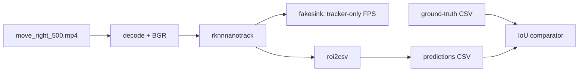
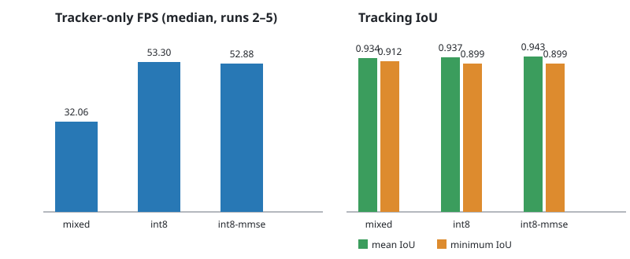
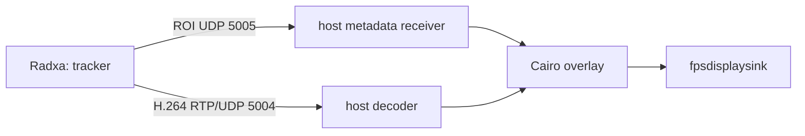

# NanoTrack V3: run and measure

This guide measures the deployed V3 tracker on the Radxa Zero 3W. It uses the
synthetic 500-frame `move_right_500.mp4` sequence and its ground-truth CSV.
Build and deploy first:

```bash
cmake --build --preset radxa-debug
./scripts/deploy.sh all
```

## Basic checks

```bash
./scripts/nanotracker/test.sh inspect
./scripts/nanotracker/test.sh smoke
./scripts/nanotracker/test.sh bench
./scripts/nanotracker/test.sh video
./scripts/nanotracker/test.sh compare
```

`bench` is the tracker-only throughput test: decode, BGR conversion,
`rknnnanotrack`, then `fakesink`. It runs five times and reports the median of
runs 2–5, so startup does not distort FPS. `video` writes tracker ROIs to CSV;
`compare` matches each prediction to ground truth by PTS (within 20 ms) and
reports mean and minimum intersection-over-union (IoU). FPS measures throughput;
IoU measures tracking accuracy.

The tracker-only benchmark pipeline is equivalent to:

```none
filesrc move_right_500.mp4 ! decodebin ! videoconvert !
video/x-raw,format=BGR,width=640,height=360 !
rknnnanotrack ... precision=<profile> resize=auto ! fakesink sync=false
```

`fakesink` deliberately discards frames: this isolates board-side decode,
colour conversion, preprocessing, RKNN inference, and tracker post-processing.
The validation pass adds `roi2csv location=predictions-<profile>.csv` immediately
after the tracker. Its FPS is recorded in the raw run, but the comparison table
uses the separate five-pass `fakesink` median so CSV disk I/O does not affect it.



## Compare deployed model profiles

Run the complete production-path comparison:

```bash
./scripts/nanotracker/test.sh matrix
```

It compares `mixed`, `int8`, and `int8-mmse` using `resize=auto` (RGA with the
plugin's OpenCV fallback). The command writes the reproducible source data and
SVG chart to `docs/guides/images/`, then updates the table below. Full FP16 is
not included because `nanotrack_head.rknn` is not deployed.

<!-- profile-results:start -->
| Profile | Median FPS | Mean IoU | Minimum IoU | Matched frames |
| --- | ---: | ---: | ---: | ---: |
| `mixed` | 31.95 | 0.9344 | 0.9125 | 500 |
| `int8` | 52.56 | 0.9367 | 0.8990 | 500 |
| `int8-mmse` | 53.05 | 0.9428 | 0.8988 | 500 |


<!-- profile-results:end -->

## Stream video and metadata

On the host, start the viewer:

```bash
python3 tools/udp_bbox_viewer.py
```

Then send the board stream, setting the host address if needed:

```bash
VIDEO_METADATA_HOST=192.168.1.10 ./scripts/nanotracker/stream.sh
```

The sender pipeline appends `roi2udp`, converts to I420, encodes H.264 with the
Radxa hardware `mpph264enc` at 4 Mb/s, packetizes with `rtph264pay`, and sends RTP/UDP port 5004. `roi2udp`
sends the tracker ROI separately to UDP port 5005. The viewer combines that
metadata with the decoded video in a Cairo overlay.



Streaming FPS is not tracker-only FPS: the current sender also performs H.264
encoding, while the host decodes, overlays, and displays frames. Use
`tools/run_recv_pipe.sh` to isolate host video receive/decode FPS, and
`tools/roi_udp_monitor.py` to count metadata packets independently. See the
[V3 optimization record](../design/nanotracker-v3-30fps-optimization.md) for
the prior selected INT8 measurements.
