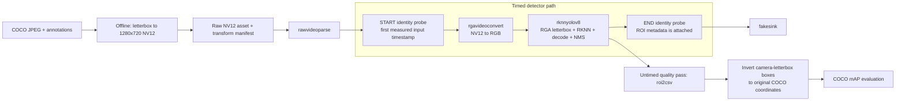

# YOLOv8 camera-equivalent detector benchmark

This guide defines the planned benchmark for the deployed `rknnyolov8`
GStreamer plugin on the Radxa Zero 3W. It measures detector throughput from a
camera-format frame at the colour-conversion boundary through completed
detection metadata. It is not a model-only RKNN benchmark and it is not a
desktop display FPS measurement.

## Workload

The fixed evaluation set is the existing deterministic 200-image COCO val2017
sample. Before timing, the host letterboxes every source image to a 1280x720
camera canvas and converts it to BT.709 limited-range NV12. That raw asset and
its original-image transform manifest are generated once, ignored by Git, and
deployed to the board.

The baseline uses `rgavideoconvert`, `rknnyolov8 resize=auto`, confidence
threshold `0.25`, and per-class NMS IoU `0.45`. The detector retains its fixed
640x640 RGB model input.



## What the timing includes

The start probe is immediately after `rawvideoparse` and immediately before
`rgavideoconvert`. The end probe is immediately after `rknnyolov8`; at that
point the buffer already contains its final `yolo8` ROI metadata.

| Included | Excluded |
| --- | --- |
| NV12-to-RGB conversion in `rgavideoconvert` | COCO JPEG decoding and offline NV12 generation |
| Plugin frame mapping and RGA letterbox | Raw-file read and parsing before the start probe |
| RKNN execution, output synchronization, CPU decode, NMS | Pipeline/model startup and warm-up frames |
| Creating ROI metadata | CSV writing, COCO scoring, network, display, and client rendering |

This is the useful camera-to-result detector measurement: it starts where a
camera's NV12 buffer enters conversion and ends where the caller can consume
the detector result. It intentionally does not claim to measure camera-sensor
capture, disk performance, or desktop playback.

## FPS and latency calculation

Each pass processes all 200 frames. The first 10 are warm-up frames and are
excluded. For every remaining frame `i`, the benchmark records:

```text
latency_ms[i] = 1000 * (end_timestamp[i] - start_timestamp[i])
detector_fps = measured_frames / (last_end_timestamp - first_measured_start_timestamp)
```

The output reports per-pass detector FPS plus p50 and p95 latency. It runs five
passes, discards pass 1, and reports the median detector FPS from passes 2-5.
This avoids selecting a result based on RKNN model load, allocator setup, or
initial clock/rate ramp-up.

The planned host command is:

```sh
bash scripts/yolov8/benchmark-camera.sh
```

It will print a machine-readable result shaped like:

```json
{
  "input_caps": "video/x-raw,format=NV12,width=1280,height=720,colorimetry=bt709,range=limited",
  "converter": "rgavideoconvert",
  "warmup_frames": 10,
  "detector_fps": 0.0,
  "latency_ms": {"p50": 0.0, "p95": 0.0},
  "quality": {"map_50_95": 0.0, "ap_50": 0.0, "ap_75": 0.0}
}
```

The zero values above are placeholders, not measured results.

## Quality measurement

Quality is calculated in a separate, untimed pass so CSV disk I/O and COCO
evaluation cannot distort detector FPS. `roi2csv` records each plugin ROI with
its frame ID, box, class ID, and confidence. The evaluator uses the transform
manifest to map those 1280x720 camera-canvas boxes back to the original COCO
image coordinates, then reports standard COCO `mAP@[.50:.95]`, `AP@.50`, and
`AP@.75`.

The benchmark fails rather than producing a misleading score when a frame ID
cannot be matched to the manifest, required CSV columns are absent, or fewer
than 200 camera frames complete.

## Reading the result

`detector_fps` is the primary number for this guide: it includes conversion,
preprocessing, NPU work, and post-processing. It is expected to be lower than
the existing RKNN-only `inference_fps`, which times only
`RKNNLite.inference()`. It also differs from client FPS, which includes local
decode, metadata synchronization, overlays, and display.

Compare only results that use the same model, source sample, input caps,
converter, `resize` mode, confidence threshold, and NMS threshold.
