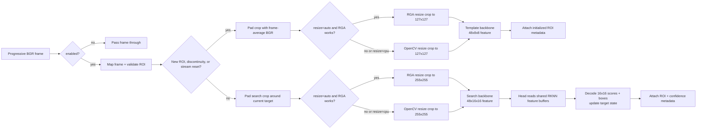

# NanoTracker V1/V2 GStreamer plugin

`rknnnanotracker12` is a separate implementation for the original NanoTrack
V1 and V2 networks. It accepts progressive BGR video and publishes the normal
`GstVideoRegionOfInterestMeta` named `nanotrack`, so `roi2csv`, `roi2udp`, and
the existing viewers work without changes.

## Frame flow



```sh
gst-launch-1.0 videotestsrc num-buffers=60 ! videoconvert ! \
  video/x-raw,format=BGR,width=320,height=240 ! \
  rknnnanotracker12 enabled=true roi='80,60,64,64' \
  models-dir=/home/radxa/gst-rknn/models/nanotracker12 model-version=v2 \
  precision=int8 resize=auto ! fakesink
```

Properties:

| Property | Description |
| --- | --- |
| `enabled` | Start tracking; changing it captures a fresh template on the next frame. |
| `roi` | Initial `x,y,width,height` in frame pixels; changing it resets tracking. |
| `models-dir` | Root containing `v1/rknn` and `v2/rknn`. |
| `model-version` | `v1` or `v2`; select before PLAYING. Default: `v2`. |
| `precision` | V2: use validated `int8` for maximum speed; `mixed` is FP16 backbones + INT8 head. V1 supports `mixed`. |
| `resize` | `auto` uses RGA then falls back to OpenCV; `cpu` always uses OpenCV. |

The V1 and V2 score grid is 16×16. Their version-specific window, penalty,
and learning-rate values come from the upstream configuration files.
