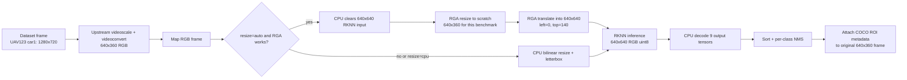

# YOLOv8 RKNN GStreamer plugin

`rknnyolov8` runs a selected YOLOv8 RKNN model on progressive RGB video and
preserves pixels while attaching one `GstVideoRegionOfInterestMeta` per final
detection. The model is loaded once during the READY-to-PAUSED transition.

## Frame flow

The plugin accepts any progressive RGB frame. This shows the benchmark path
for the 1280x720 UAV123 source, which is scaled upstream to 640x360 before it
reaches the element. Other input sizes use the same proportional letterbox
calculation.



## Properties

| Property | Default | Description |
| --- | --- | --- |
| `model` | required | Exact path to an INT8 or hybrid-INT8 YOLOv8 RKNN file. |
| `confidence-threshold` | `0.25` | Minimum class confidence. |
| `nms-iou-threshold` | `0.45` | Same-class NMS IoU threshold. |
| `max-detections` | `100` | Maximum ROI metadata records per frame. |
| `resize` | `auto` | `auto` uses RGA and falls back permanently to CPU; `cpu` disables RGA. |

All properties are READY-only. Input and output caps are progressive
`video/x-raw,format=RGB`; use `videoconvert` before the element as needed.

## Metadata

Each detection has `roi_type="yolo8"`, a bounding box in original-frame
coordinates, and `id` set to the standard COCO category ID. Its `"yolo8"`
parameter structure contains `confidence` as a double. `roi2csv` and `roi2udp`
serialize the confidence and append `class_id`; existing tracker records keep
that new column empty.

## Performance review

The model, RKNN input/output buffers, and RGA scratch buffer are created once
when the element starts. The following per-frame work is worth measuring on the
board before changing code:

1. The benchmark's upstream 1280x720-to-640x360 scale makes the plugin's RGA
   resize an identity operation. Compare keeping the original frame until the
   plugin against the current two-stage path.
2. RGA preprocessing clears the 640x640 input on the CPU, then submits resize
   and translate as separate RGA jobs through a scratch buffer. Test a
   one-pass RGA letterbox operation if the installed `librga` supports the
   required destination rectangle semantics.
3. RGB conversion, CPU mapping, and per-frame virtual-address RGA imports
   prevent a fully zero-copy decoder-to-RGA-to-RKNN path. Profile them before
   pursuing DMABuf interop.
4. Decode scans 80 classes for every output cell; NMS compares each candidate
   with already-kept detections. Profile these CPU stages on crowded scenes
   before optimizing them, because NPU inference may still dominate.

Use the same model, input sequence, thresholds, and `resize=auto`/`resize=cpu`
comparison for each experiment. Record end-to-end FPS and per-stage latency;
do not select an optimization solely from model-only FPS.

## Radxa smoke test

```sh
bash scripts/yolov8/test-plugin.sh
```

The script cross-compiles, deploys the module and YOLO assets, runs
`gst-inspect-1.0`, then validates `bus.jpg` metadata against the five published
Model Zoo detections. Set `YOLO_MODEL` to test the deployed hybrid artifact or
`YOLO_RESIZE=cpu YOLO_CONFIDENCE=0.2` to exercise the CPU fallback with the
reference smoke threshold.
